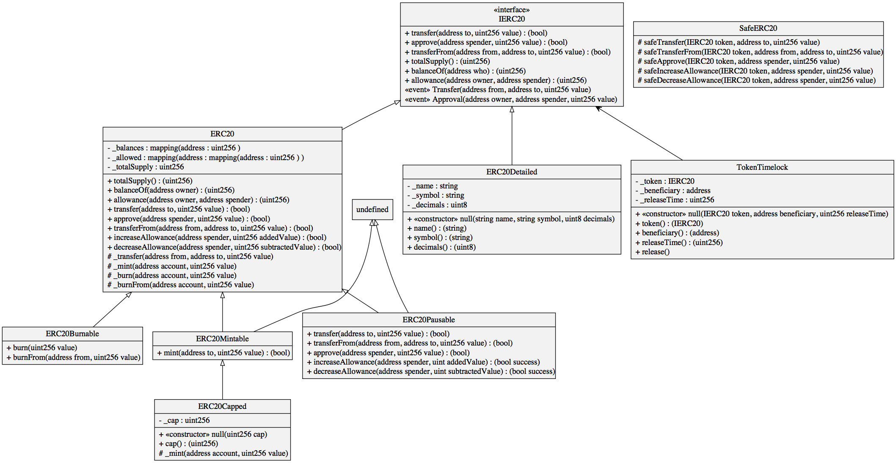
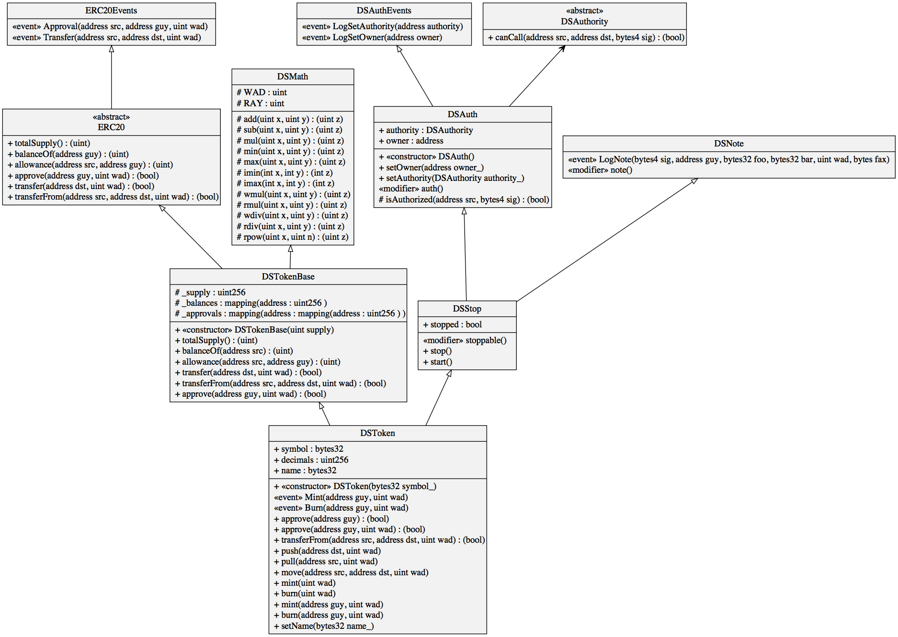

# solidity-diagram-gen
UML class diagram generator for solidity contracts.

## Install

Check out the repository from GitHub and npm install the dependencies
```Bash
git clone https://github.com/naddison36/solidity-diagram-gen.git
npm install
```

## Usage

To see the usage options
```Bash
$ node sol2uml.js -h

Usage: sol2uml [options] <file or root folder>

Generates UML diagrams from Solidity source code

Options:
  -v, --verbose         With debugging statements
  -o, --output [value]  File outputs: svg, png or both (default: "svg")
  -h, --help            output usage information

```

To generate the test contracts in this repo
```Bash
$ node sol2uml.js ./contracts
```

To generate a SVG diagram of all Solidity files under some root folder. Output will be a `diagram.svg` file in the working folder.
```Bash
$ node sol2uml.js path/to/contracts/root/folder
```

To generate a SVG diagram of all contracts in a single Solidity file. Output will be a `diagram.svg` file in the working folder.
```Bash
$ node sol2uml.js path/to/contracts/root/folder/solidity/file.sol
```

To generate SVG and PNG diagrams of all Solidity files under some root folder.  Output will be `diagram.svg` and `diagram.png` files in the working folder.
```Bash
$ node sol2uml.js -o both path/to/contracts/root/folder
```

## Examples

### Open Zeppelin 2.1.2

#### ERC20 Tokens

[Source folder](https://github.com/OpenZeppelin/openzeppelin-solidity/tree/v2.1.2/contracts/token/ERC20)

### MakerDAO's SAI Token

[Source file](https://github.com/bokkypoobah/MakerDAOSaiContractAudit/blob/master/audit/deployed-contracts/DSTokenSai-0x89d24A6b4CcB1B6fAA2625fE562bDD9a23260359.sol)

## About

This is a fork of the Richard Ramos's [solidity-diagram-gen](https://github.com/richard-ramos/solidity-diagram-gen) tool which no longer works as it uses the Solidity parser [solidity-parser](https://www.npmjs.com/package/solidity-parser/v/0.4.0). This parser can not handle newer Solidity syntax like `constructor`.

This version uses the [solidity-parser-antlr](https://github.com/federicobond/solidity-parser-antlr) Solidity parser which is built on top of [ANTLR4 grammar](https://github.com/solidityj/solidity-antlr4).

The diagrams are generated using [viz.js](https://github.com/mdaines/viz.js/) which uses [Graphviz](http://www.graphviz.org/) to render a SVG file.
