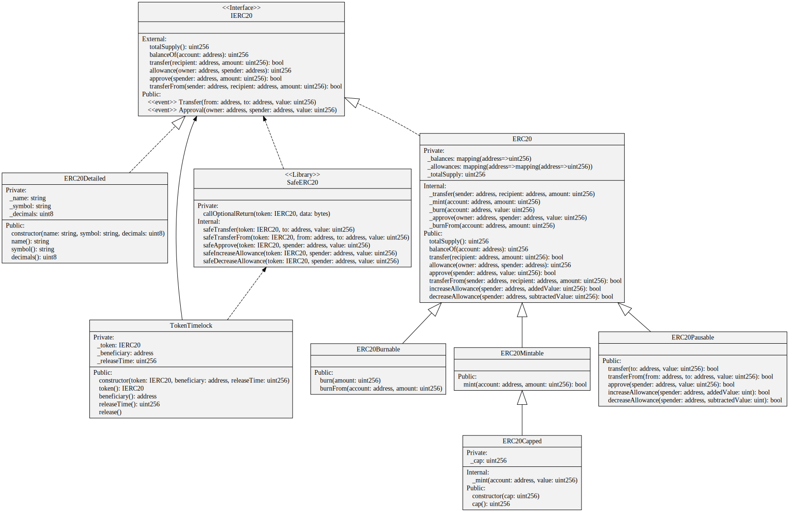

# Solidity 2 UML

[](https://badge.fury.io/js/sol2uml)

[Unified Modeling Language (UML)](https://en.wikipedia.org/wiki/Unified_Modeling_Language) [class diagram](https://en.wikipedia.org/wiki/Class_diagram) generator for [Solidity](https://solidity.readthedocs.io/) contracts.

Open Zeppelin's ERC20 token contracts generated from [version 2.3.0](https://github.com/OpenZeppelin/openzeppelin-solidity/tree/v2.3.0/contracts/token/ERC20)


See [examples](./examples/README.md) for more diagrams.

# Install

The following installation assumes [Node.js](https://nodejs.org/en/download/) has already been installed which comes with [Node Package Manager (NPM)](https://www.npmjs.com/).

To install globally so you can run `sol2uml` from anywhere
```bash
npm link sol2uml --only=production
```

To upgrade run
```bash
npm upgrade sol2uml -g
```

To see which version you are using
```bash
npm ls sol2uml
```

# Usage

## Command Line Interface (CLI)

To see the usage options
```
$ sol2uml -h
Usage: sol2uml <fileFolderAddress> [options]

Generates UML diagrams from Solidity source code.
If no file, folder or address is passes as the first argument, the working folder is used.
When a folder is used, all *.sol files are found in that folder and all sub folders.
If an Ethereum address with a 0x prefix is passed, the verified source code from Etherscan will be used.

Options:
  -b, --baseContractNames <value>  only output contracts connected to these comma separated base contract names
  -f, --outputFormat <value>       output file format: svg, png, dot or all (default: "svg")
  -o, --outputFileName <value>     output file name
  -d, --depthLimit <depth>         number of sub folders that will be recursively searched for Solidity files. Default -1 is unlimited (default: -1)
  -n, --network <network>          mainnet, ropsten, kovan, rinkeby or goerli (default: "mainnet")
  -k, --etherscanApiKey <key>      Etherscan API Key
  -c, --clusterFolders             cluster contracts into source folders
  -v, --verbose                    run with debugging statements
  -h, --help                       output usage information
```

To generate a diagram of all contracts under the contracts folder and its sub folders
```bash
sol2uml ./contracts
```

To generate a diagram of EtherDelta's contract from the verified source code on [Etherscan](https://etherscan.io/address/0x8d12A197cB00D4747a1fe03395095ce2A5CC6819#code). The output wil be a svg file `0x8d12A197cB00D4747a1fe03395095ce2A5CC6819.svg` in the working folder.
```bash
sol2uml 0x8d12A197cB00D4747a1fe03395095ce2A5CC6819
```

To generate a diagram of EtherDelta's contract from the verified source code on [Etherscan Ropsten](https://ropsten.etherscan.io/address/0xa19833bd291b66aB0E17b9C6d46D2Ec5fEC15190#code). The output wil be a svg file `0xa19833bd291b66aB0E17b9C6d46D2Ec5fEC15190.svg` in the working folder.
```bash
sol2uml 0xa19833bd291b66aB0E17b9C6d46D2Ec5fEC15190 -n ropsten
```

To generate all Solidity files under some root folder and output the svg file to a specific location
```bash
sol2uml path/to/contracts/root/folder -o ./outputFile.svg
```

To generate a diagram of all contracts in a single Solidity file, the output file in png format to output file `./someFile.png`
```bash
sol2uml path/to/contracts/root/folder/solidity/file.sol -f png -o ./someFile.png
```

To generate diagrams of all Solidity files under some root folder.  The output will be `contracts.svg` and `contracts.png` files in the working folder.
```bash
sol2uml ./contracts -f all -v
```

## Application Programming Interface (API)

The main function that parses Solidity source code from files or files in folders is [parseUmlClassesFromFiles](./lib/fileParser.d.ts#L3). This returns an array of UML class objects.
 
[EtherscanParser](./lib/etherscanParser.d.ts#L5) is a class that parses Etherscan's verified Solidity source code for a contract. For example
```ts
import { convertUmlClassesToSvg, EtherscanParser } from 'sol2uml'

async function generateSvg() {
  const etherscanParser = new EtherscanParser()

  // get the verified source code from Etherscan for the contract address and
  // parse Solidity into UML class objects
  const umlClasses = await etherscanParser.getUmlClasses('0xf5dce57282a584d2746faf1593d3121fcac444dc')

  // Convert UML classes to a svg string
  const svg = await convertUmlClassesToSvg(umlClasses)
}
```

[generateFilesFromUmlClasses](./lib/converter.d.ts#L3) is used to write the dot, svg and png files from an array of UML class objects.

# UML Syntax

Good online resources for learning UML
* [UML 2 Class Diagramming Guidelines](http://www.agilemodeling.com/style/classDiagram.htm)
* [Creating class diagrams with UML](https://www.ionos.com/digitalguide/websites/web-development/class-diagrams-with-uml/)

## Terminology differences

A Solidity variable becomes an attribute in UML and a Solidity function becomes an operation in UML.

## Stereotypes

### Class stereotypes

* Interface
* Abstract - if any of the contract's functions are abstract, the class will have an Abstract stereotype. Child contracts of abstract contracts that do not implement all the abstract functions are currently not marked as Abstract.
* Library

### Operator stereotypes

* event
* modifier
* abstract - is there is no function body on a contract, the operator is marked as abstract. Operators on an Interface do not have an abstract stereotype as all operators are abstract.
* fallback - abstract fallback functions will just have an abstract stereotype.
* payable - payable fallback functions will just have a fallback stereotype.

## UML Associations

Lines:
- Solid lines are used to link the contract types of storage (state) variables. This can be linked to contracts, interfaces or libraries.
- Solid lines are also used for generalisations of contracts and abstract contracts.
- Solid lines are also used for aggregated structs and enums
- Dashed lines are used or generalisations of interfaces.
- Dash lines are also used for types of memory variables.

Heads/Tails:
- An empty triangle head is used for generalisations of contracts, interfaces and abstract contracts.
- An open arrow head is used for storage or memory variable dependencies
- A diamond tail is used for aggregations of structs and enums

# About

This is a rewrite of the Richard Ramos's [solidity-diagram-gen](https://github.com/richard-ramos/solidity-diagram-gen) tool which no longer works as it uses [solidity-parser](https://www.npmjs.com/package/solidity-parser/v/0.4.0) which cannot handle newer Solidity syntax like `constructor`.

This version uses Federico Bond's (GitHub @federicobond) [solidity-parser-antlr](https://github.com/federicobond/solidity-parser-antlr) Solidity parser which is built on top of [ANTLR4 grammar](https://github.com/solidityj/solidity-antlr4). The logic to generate the dot syntax has been rewritten and different UML syntax is now used to Richard Ramos's original implementation.

The diagrams are generated using [viz.js](https://github.com/mdaines/viz.js/) which uses [Graphviz](http://www.graphviz.org/) to render a [Scalable Vector Graphics (SVG)](https://en.wikipedia.org/wiki/Scalable_Vector_Graphics) file. [Graphviz Online](https://dreampuf.github.io/GraphvizOnline/) allows dot files to be edited and rendered into a SVG dynamically.
