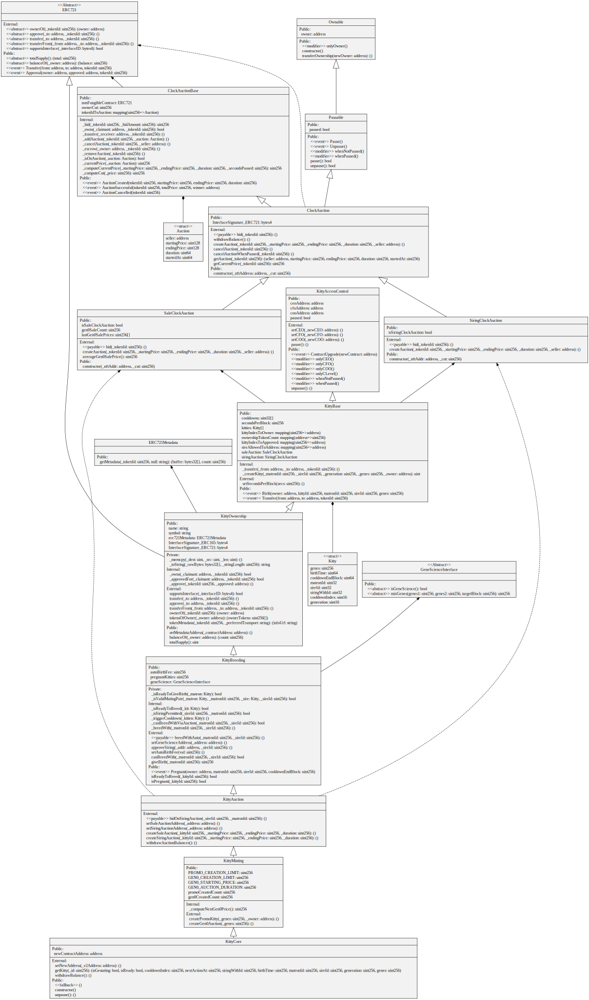
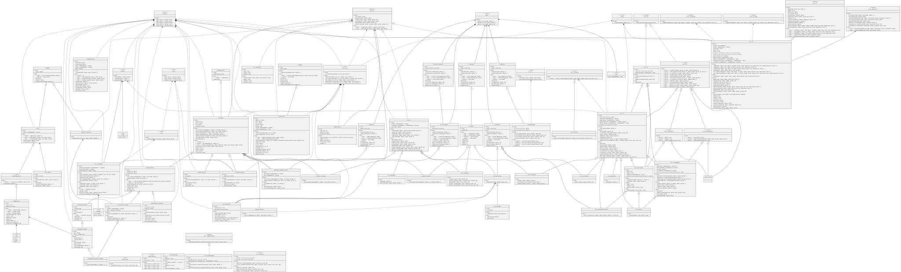
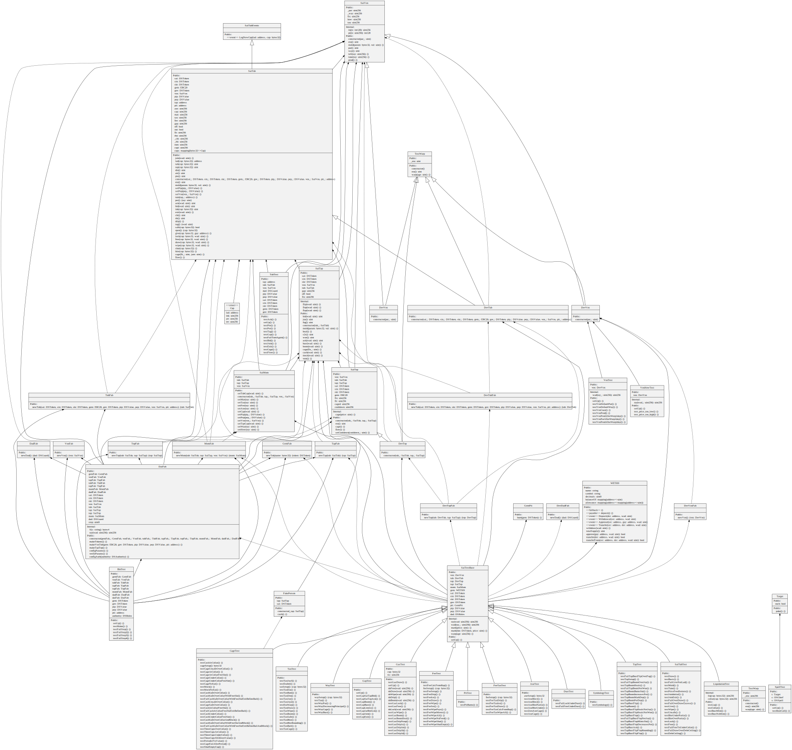
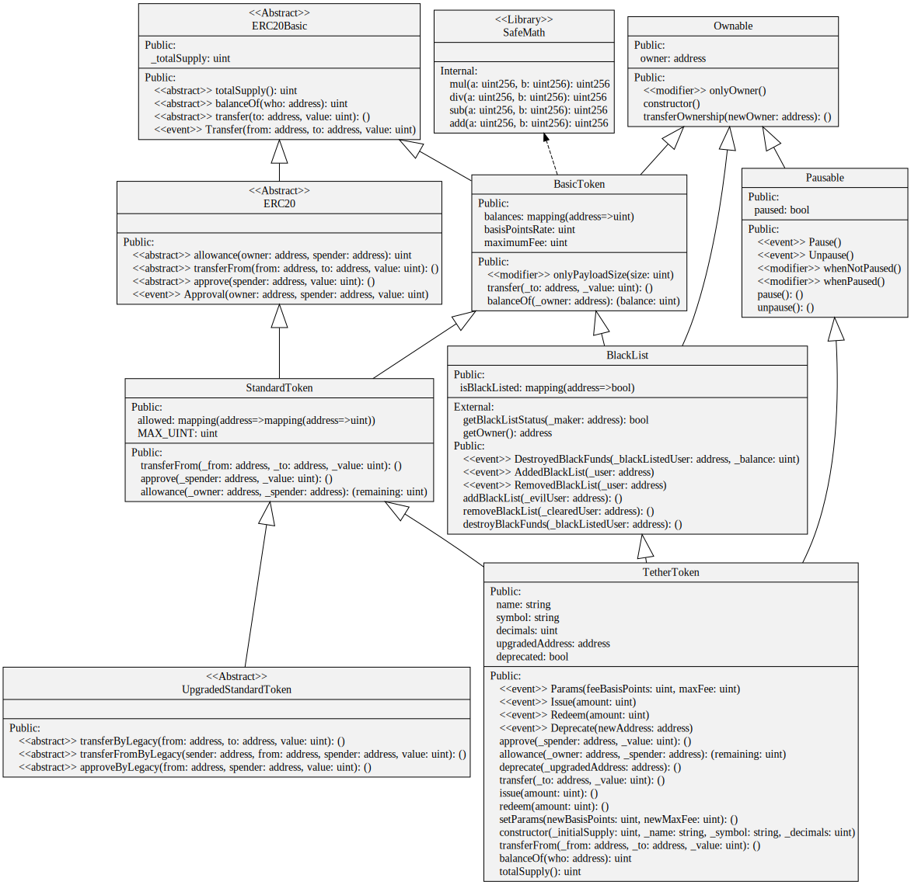
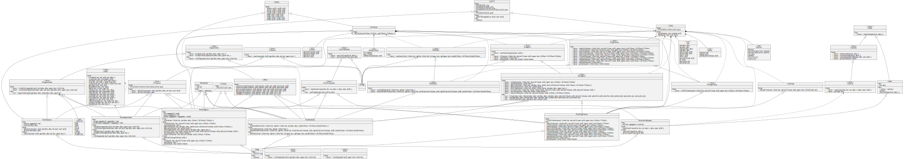
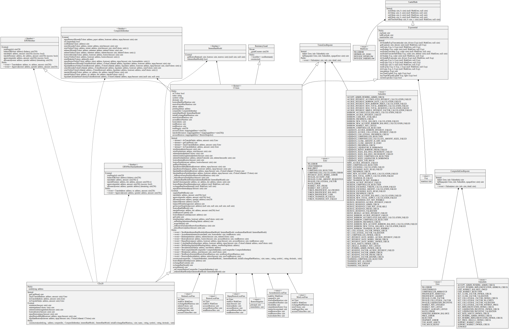

# Example UML Diagrams

## Crypto Kitties

Generated from running
```
sol2uml 0x06012c8cf97BEaD5deAe237070F9587f8E7A266d
```
This uses the verified Solidity code loaded to Etherscan https://etherscan.io/address/0x06012c8cf97BEaD5deAe237070F9587f8E7A266d#code

## Open Zeppelin ERC20 Tokens

Generated from version [2.3.0 contracts/token/ERC20](https://github.com/OpenZeppelin/openzeppelin-solidity/tree/v2.3.0/contracts/token/ERC20)

## Open Zeppelin All

Generated from version [2.3.0 contracts](https://github.com/OpenZeppelin/openzeppelin-solidity/tree/v2.3.0/contracts)

## MakerDAO's SAI Token

Generated from GitHub commit [84c682eeb4e27264503370ef5aafcb9ee3217acb](https://github.com/makerdao/sai/tree/84c682eeb4e27264503370ef5aafcb9ee3217acb/src) of makerdao/sai/src

## Tether

Generated from running
```
sol2uml 0xdAC17F958D2ee523a2206206994597C13D831ec7
```
This uses the verified Solidity code loaded to Etherscan https://etherscan.io/address/0xdac17f958d2ee523a2206206994597c13d831ec7#code

## 0x

Generated from running
```
sol2uml 0x4F833a24e1f95D70F028921e27040Ca56E09AB0b
```
This uses the verified Solidity code loaded to Etherscan https://etherscan.io/address/0x4F833a24e1f95D70F028921e27040Ca56E09AB0b#code

## Compound Finance's cDAI

Generated from running
```
sol2uml 0xf5dce57282a584d2746faf1593d3121fcac444dc
```
This uses the verified Solidity code loaded to Etherscan https://etherscan.io/address/0xf5dce57282a584d2746faf1593d3121fcac444dc#code
