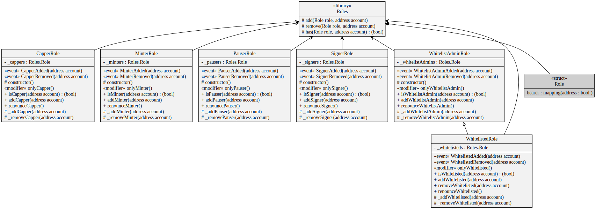
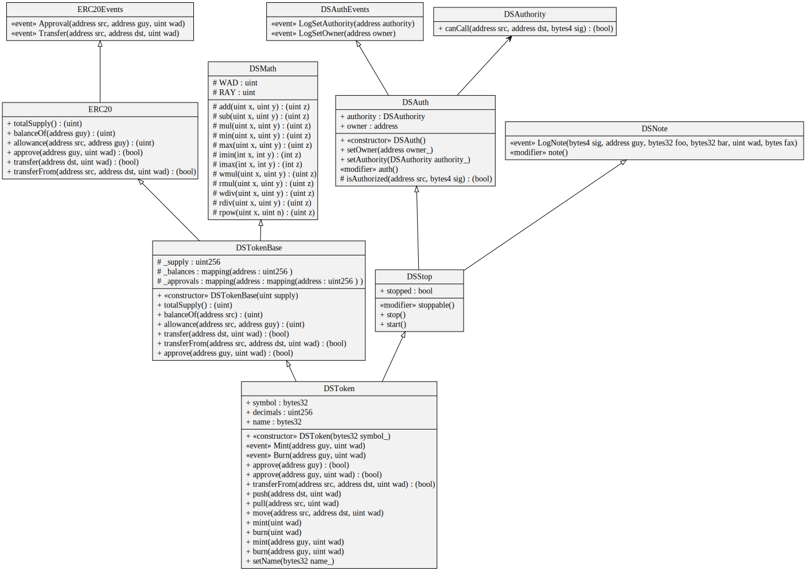
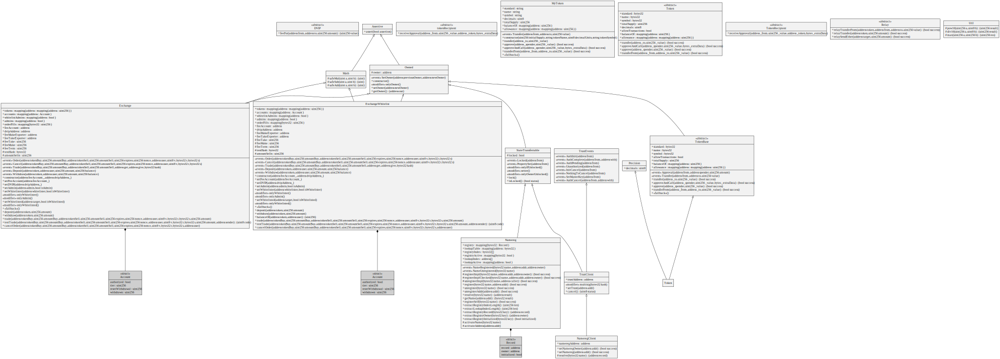
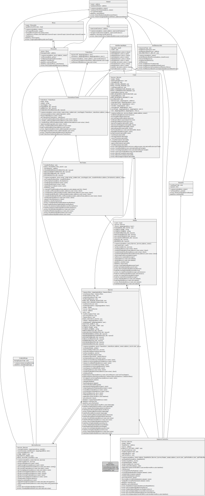

# Exmaple UML Diagrams

## Open Zeppelin ERC20 Tokens

[Generated from version 2.1.2 contracts/token/ERC20](https://github.com/OpenZeppelin/openzeppelin-solidity/tree/v2.1.2/contracts/token/ERC20)

## Open Zeppelin Access

[Generated from version 2.1.2 contracts/access](https://github.com/OpenZeppelin/openzeppelin-solidity/tree/v2.1.2/contracts/access)

## MakerDAO's SAI Token

[Generated from audit/deployed-contracts/DSTokenSai-0x89d24A6b4CcB1B6fAA2625fE562bDD9a23260359.sol](https://github.com/bokkypoobah/MakerDAOSaiContractAudit/blob/master/audit/deployed-contracts/DSTokenSai-0x89d24A6b4CcB1B6fAA2625fE562bDD9a23260359.sol)

## IDEX

[Generated from IDEX master](https://github.com/AuroraDAO/idex)

## Havven

[Generated from Havven master](https://github.com/Havven/havven/tree/master/contracts)
