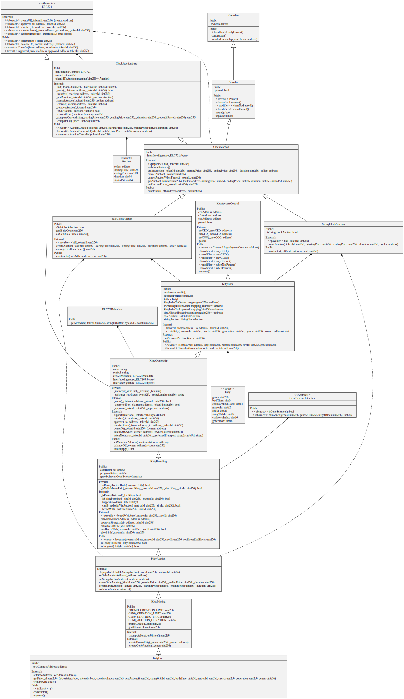
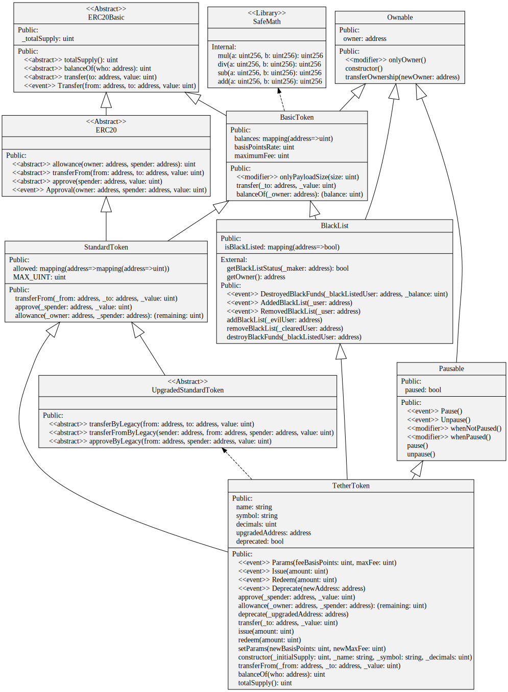

# Example UML Diagrams

## Crypto Kitties

Generated from Etherscan verified source code of contract [0x06012c8cf97BEaD5deAe237070F9587f8E7A266d](https://etherscan.io/address/0x06012c8cf97bead5deae237070f9587f8e7a266d#code)

## Open Zeppelin ERC20 Tokens

Generated from version [2.3.0 contracts/token/ERC20](https://github.com/OpenZeppelin/openzeppelin-solidity/tree/v2.3.0/contracts/token/ERC20)

## Open Zeppelin All

Generated from version [2.3.0 contracts](https://github.com/OpenZeppelin/openzeppelin-solidity/tree/v2.3.0/contracts)

## MakerDAO's SAI Token

Generated from GitHub commit [84c682eeb4e27264503370ef5aafcb9ee3217acb](https://github.com/makerdao/sai/tree/84c682eeb4e27264503370ef5aafcb9ee3217acb/src) of makerdao/sai/src

## Tether

Generated from Etherscan verified source code of contract [0xdAC17F958D2ee523a2206206994597C13D831ec7](https://etherscan.io/address/0xdac17f958d2ee523a2206206994597c13d831ec7#code)
